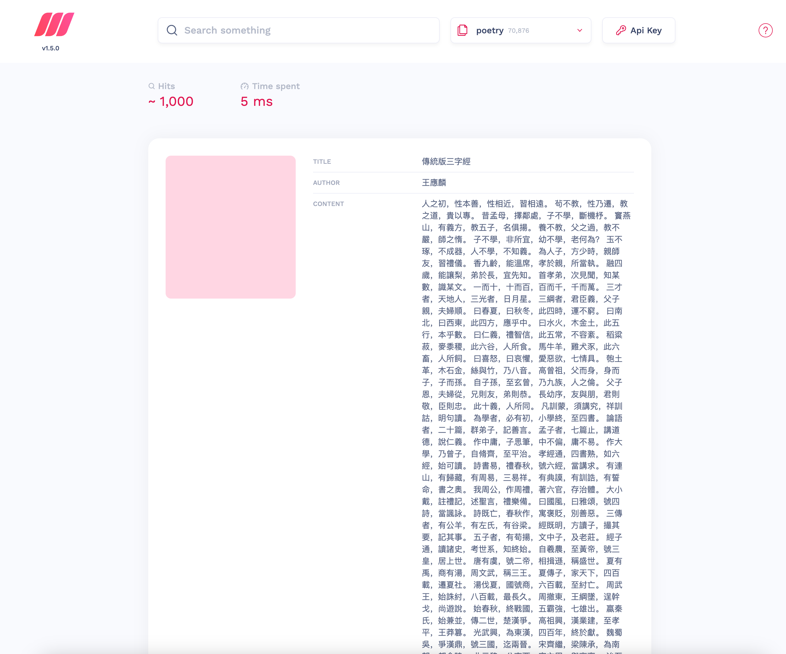

# chinese-poetry-index

这个是构建 [chinese-poetry](https://github.com/chinese-poetry/chinese-poetry) 仓库索引的一个库，目的是抽离出规范的文本特征对象，以便我们能够统一调用。不仅如此，我们还构建了一个全文搜索容器，你可以在面板中搜索超过 7 万条数据，检索时间不超过 10ms！



1. 曹操诗集
2. 楚辞
3. 论语
4. 蒙学
    1. 三字经
    2. 百家姓
    3. 千字文
    4. 弟子规
    5. 幼学琼林
    6. 朱子家训
    7. 千家诗
    8. 唐诗三百首
    9. 声律启蒙
    10. 文字蒙求
    11. 增广贤文
5. 纳兰性徳
6. 全唐诗
7. 诗经
8. 水墨唐诗
9. 四书五经
10. 宋词
11. 五代诗词
    1. 花间集
    2. 南唐
12. 幽梦影（未完成）
13. 御定全唐诗（未完成）
14. 元曲

## 从原始仓库构建数据

```sh
pnpm install
pnpm build # 规范化 原始数据文件，将会存储在 dist 目录
pnpm build:index # 建立索引 json 文件，将会建立在 json 目录
```

## 创建 .env 文件

```txt
MEILI_MASTER_KEY=PASSWORD
MEILI_SERVER=http://meilisearch:7700
```

## 启动 docker 自动部署

```
docker-compose up -d
```

ps: docker 容器需要静置一会，等数据充分加载到 meilisearch 中，然后打开 localhost:7700

## 数据迁移

meilisearch 的数据都在 meili_data 这个文件夹中
